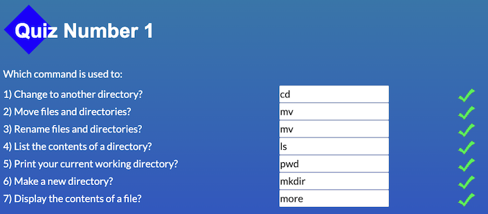
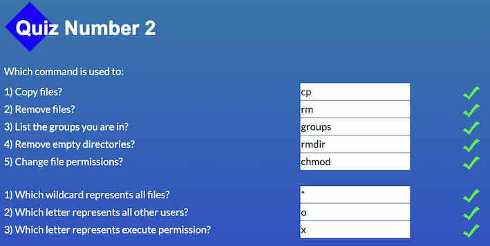
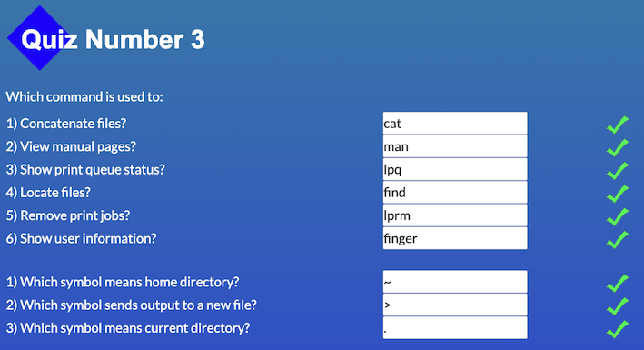
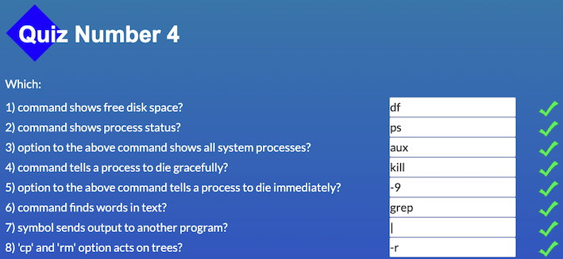
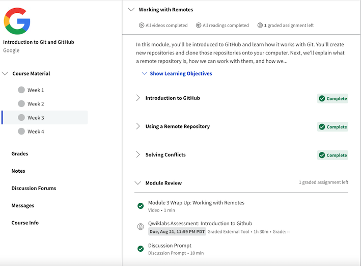
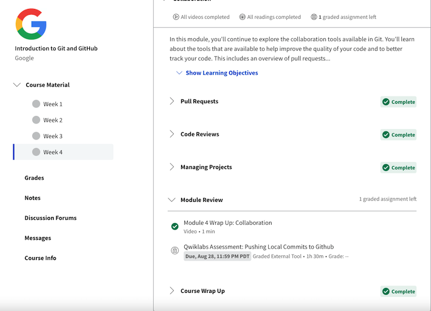
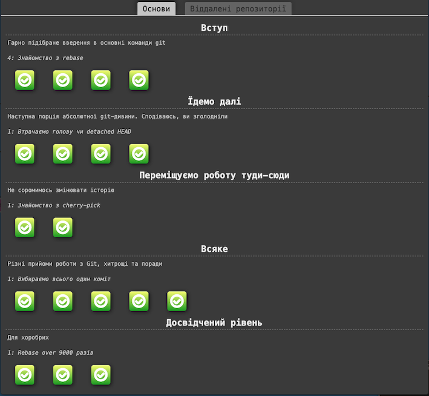
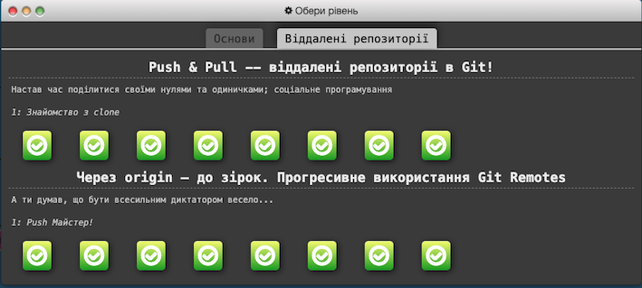

## General
## 0.  [Git Basics](https://github.com/kottans/frontend/blob/2022_UA/tasks/git-intro.md) :white_check_mark:
 

Враження

>   __,,,^._.^,,,__

> Сподобалися лекції від Google. Цікавим і новим було порівняння команд command line і git (diff, patch), а також рекомендації щодо написання коммітів.

## 1.  [Linux CLI and Networking](https://github.com/kottans/frontend/blob/2022_UA/tasks/linux-cli-http.md) :white_check_mark:
 

Враження та скрiншоти

> Сподобався курс з консольних команд, дуже наочний та добре структурований. Новим було | (планую використовувати в майбутньому) і такі команди як lpr, df і таке інше, які зараз зручніше виконувати через інтерфейс.

> Освіжила у пам'яті заголовки та статуси запитів, дізналася про ws. У разі потреби розумітиму в який бік гуглити.

## 2.  [Git Collaboration](https://github.com/kottans/frontend/blob/2022_UA/tasks/git-collaboration.md) :white_check_mark:
 

Враження та скрiншоти

> Поглибила свої знання про створення та роботу з гілками у git. Краще зрозуміла як працює rebase і що відбувається при відокремлені HEAD, цікавим і новим були переходи по комітах за допомогою ^ і ~, деякі можливості додаткових аргументів для push, pull і fetch, а також cherry-pick, усе це й планую використовувати в подальшій роботі.

# Front-End Basics
## 3. [Intro to HTML & CSS](https://github.com/kottans/frontend/blob/2022_UA/tasks/html-css-intro.md) :black_square_button:
## 4. [Responsive Web Design](https://github.com/kottans/frontend/blob/2022_UA/tasks/html-css-responsive.md):black_square_button:
## 5. [HTML & CSS Practice](https://github.com/kottans/frontend/blob/2022_UA/tasks/html-css-popup.md) :black_square_button:
## 6. [JavaScript Basics](https://github.com/kottans/frontend/blob/2022_UA/tasks/js-basics.md) :black_square_button:
## 7. [Document Object Model](https://github.com/kottans/frontend/blob/2022_UA/tasks/js-dom.md) - practice :black_square_button: