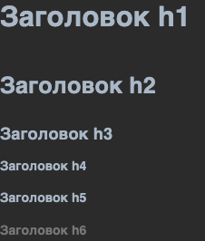

## Git Basis
# Трошки додаткової інформації

- [ ] [Лекція по Git від Олексія Руденка](https://www.youtube.com/playlist?list=PLS8sEUxbfFY9MnPIFPTNlaS5xX7P5Ge-5)

   In progress 1/5

- [ ] [Git за 30 хвилин](https://codeguida.com/post/453)

- [ ] [Git tips](http://sixrevisions.com/web-development/git-tips/) — закріпити свої знання про Git

- [x] [About Merge Conflicts](https://docs.github.com/en/free-pro-team@latest/github/collaborating-with-issues-and-pull-requests/about-merge-conflicts)

- [x] [Resoilving a Merge Conflict](https://docs.github.com/en/free-pro-team@latest/github/collaborating-with-issues-and-pull-requests/resolving-a-merge-conflict-using-the-command-line)

- [x] [Communicating using Markdown](https://lab.github.com/githubtraining/communicating-using-markdown)

<details>
<summary> Міні конспект з MD</summary>

Комментарии можно делать отступами. Спецальные символы экранируются c помощью \ . Отступы, пробелы и переносы необходимы, без них отображение будет неправильным.

1. Заголовки
   ```
    # H1
    ## h2
    ### h3
    #### h4
    ##### h5
    ###### h6
   ```
   Пример отображения ниже :arrow_down:
 
2. Изображения

    ``

    Например:

    

    или

    


3. Ссылки

    `[желаемый текст](url)` - выглядит как ссылка со списком эмоджи ниже :arrow_down:

4. Эмоджи
  
    `:название:`
[Эмоджи, которые работают на гитхабе](https://gist.github.com/rxaviers/7360908)

5. Списки

    ``` 
   * или - Ненумерованный 1
   * или - Ненумерованный 2
       * или - Ненумерованный 2.1
       * или - Ненумерованный 2.2
   ```
   или
    ``` 
   1. Нумерованный 1
   2. Нумерованный 2
       1. Нумерованный 2.1
       2. Нумерованный 2.2
   ```
    Подпункты определяются отступами

- раз
- два
    - три
    * четыре
        * пять
        - шесть
      


6. Выделение текста
        
    `*text* or _text_` - *Italic*

    `**text** or __text__` - **Bold**

7. Цитаты (линия слева)

    `> Текст, который надо выделить` 
    > Выглядит так

8. Блоки кода

* инлайновый блок с кодом, выглядит так: `let a = 0`
    ``` 
    `текст кода`
    ```
* отдельный блок с кодом, выглядит так:

      ```
      текст кода
      ```
    Выглядит так:
    ```
    let a = 0;
    ```
* отдельный блок с кодом и подсветкой синтаксиса(можно выбрать)
 
      ```sh
      текст кода
      ```
    Выглядит так:
    ```sh
    let a = 0; 
    ```
    
9. Дропдаун

    ```sh
     <details>
        <summary> Заголовок </summary>
         Скрытй текст
     </details>
   ```
    выглядит как этот конспект


10. Таблицы 

    ```
    Первый хедер | Второй хедер 
    ------------ | ------------
    row 1 col 1  | row 1 col 2
    row 2 col 1  | row 2 col 2
    ```
    Kоличество колонок регклируется во втором ряду: - | - | - это три колонки.
    Для создания колонок надо минимум три -, строки создаются на новых линиях, прерывается отступом минимум в одну строкую.

    | Вот | так | вот |
    |-----|-----|-----|
    | на  | при | мер |

11. ToDo list

    ``` 
    - [x] - уже готово
    - [ ] - еще не готово
    ```
- [x] сделать конспект по md
- [ ] выучить всё остальное

    Можно заменить эмоджи, которые можно ставить с любой стороны от задачи 
`:white_check_mark:` => :white_check_mark:  и `:black_square_button:` =>  :black_square_button:
 
12. Short links
    ```
    @имя  - тегнуть
    url, #номер, GH-номер - ссылка на PR
    url, SHA, user@SHA - ccылка на commit
    ```
</details>

- [ ] [Learn anything front-end](https://learn-anything.xyz/web-development/front-end)

- [ ] [TypingClub](https://www.typingclub.com/) — покращити швидкість набору на клавіатурі
  
   In progress [6%](https://www.edclub.com/sportal/program-3.game) 

- [x] [How to Learn and Cope with Negative Thoughts(ru)](https://guides.hexlet.io/ru/learning/)

- [ ] ?? [Coursera modules, week 1](https://www.coursera.org/learn/introduction-git-github/home/week/1)

- [ ] ?? [Coursera modules, week 2](https://www.coursera.org/learn/introduction-git-github/home/week/2)