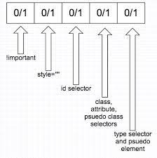

# Адаптивний Web Design

- [x]  [Responsive web design basics](https://web.dev/i18n/en/responsive-web-design-basics/)

<details>
   <summary>Невеличкий конспект (не знаю навіщо)</summary>

- `<meta name="viewport" content="width=device-width, initial-scale=1">`   - метатег viewport управляет размерами и масштабированием страницы. width=device-width предписывает странице соответствовать ширине экрана, initial-scale=1 предписывает браузерам устанавливать соотношение 1:1 (есть другие варианьы, но они могут заблокировать изменение масштаба)
- избегать горизонатльной прокрутки
- ```
   img {
     max-width: 100%;
     display: block;
   }
   ``` 
  не позволяет изображению превышать размеры области просмотра. + указанные `width` и `height` резервируют место под изображение на странице, если для его загрузки необходимо время
- задавать размеры элементов макета в относительных величинах(%), можно использовать возможости `flex` и  `grid`
- `@import` в css замедляет загрузку страницы
- критически важные css свойства стоит задавать inline
- `@media`: 
   - `orientation: portrait/ landscape` -  зависимость от того, что больше - высоты экрана или его широта
   - `aspect-ratio/min-aspect-ratio/max-aspect-ratio: width/height` - стили в зависимости от отношения ширины эерана к его высоте, например л=для iframe
   - `print` - стили для печати страницы
   - `height/min-height/max-height` - стили в зависимости от высоты области просмотра
   - `width/min-width/max-width` - стили в зависимости от ширины экрана
   - `hover: hover/none` - стили в зависимости от взможности применения hover 
   - `pointer: coarse/fine/none` - стили в зависимости от "точности указывающего устройства" - неточное/точное/отсуствует

   > смартфоны, устройства с сенсорным экраном, с которым работают пальцами 
      `@media (hover: none) and (pointer: coarse) {}`

   > устройства с сенсорным экраном, с которым работают стилусом
      `@media (hover: none) and (pointer: fine) {}`

   > контроллер Nintendo Wii, Microsoft Kinect
      `@media (hover: hover) and (pointer: coarse) {}`

  > мышь, тачпад
  `@media (hover: hover) and (pointer: fine) {}`

- оптимизация начиная с маленьких экранов + дополнительные точки остановки при необходимости
- оптимизация текста для чтения - 70-80 символов в строке (~ 550px при размере шрифта 16px)

</details>

- [x]  [FLEXBOX. Вчимося верстати на флексах](https://www.youtube.com/playlist?list=PLM6XATa8CAG5mPV60dMmjMRrHVW4LmV2x)

- [x]  [Flexbox Froggy](http://flexboxfroggy.com/) - гра для закріплення

- [x] [CSS Grid Layout](https://www.youtube.com/watch?v=GV92IdMGFfA&list=PLM6XATa8CAG5pXQrW_kDaeZb_uIAMNZIm)

- [x]  [Grid Garden](http://cssgridgarden.com/) - гра для закріплення


## Додаткові матеріали

- [x] [Specificity](https://developer.mozilla.org/uk/docs/Web/CSS/Specificity)

- [x] [Specificity calculator](https://specificity.keegan.st/)
- [x] [11 things I learned reading the flexbox spec](https://medium.com/hackernoon/11-things-i-learned-reading-the-flexbox-spec-5f0c799c776b)
<details>
   <summary>Невеличкий конспект (не знаю навіщо)</summary>

- `margin`  не схлопываются
- `margin-...: auto` переносит элемент отдельно (аналог align-self для justify)
- `min-width: auto` стоит по умолчанию и соответствует минимальному неделимому контенту, лкчится `min-width:0`
- полезные сокращения:
```  
  flex: 0 1 auto = initial (по умолчанию)
  flex: 1 1 auto = flex: auto
  flex: 0 0 auto = flex: none
```
- `z-index` работает даже если `position: static`
- `flex-basis`??

</details>

- [ ] [Flexbox Zombies](https://flexboxzombies.com/p/flexbox-zombies) (game)
- [ ] [HiDPI Screens and Web Development](https://tech.cars.com/hidpi-screens-and-web-development-72eb9b07ce7)
